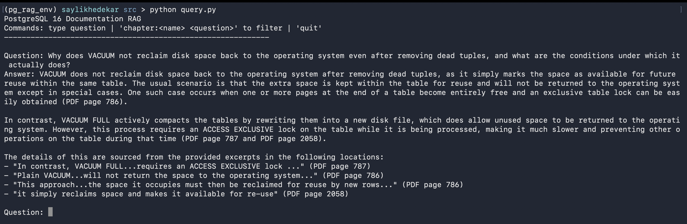

# pgvector-docs-assistant

A local Retrieval-Augmented Generation (RAG) system that answers PostgreSQL DBA questions using the official PostgreSQL 16 documentation as its knowledge base.

Built with pgvector for semantic search, PostgreSQL full-text search, and Reciprocal Rank Fusion (RRF) for hybrid retrieval.

## How It Works

1. The PostgreSQL 16 documentation PDF is chunked and embedded using OpenAI `text-embedding-3-small`
2. Embeddings are stored in a local PostgreSQL 18 database using pgvector
3. Questions are classified by type and searched using Adaptive Hybrid Search (dense vector + FTS)
4. Top results are passed to `gpt-4o-mini` which answers with citations

## Tech Stack

| Component | Choice |
|---|---|
| Database | PostgreSQL 18 |
| Vector extension | pgvector (HNSW index) |
| Embedding model | text-embedding-3-small (1536 dims) |
| LLM | gpt-4o-mini |
| PDF extraction | PyMuPDF |
| Python DB driver | psycopg v3 |
| Search | Dense vector + tsvector FTS + RRF |

## Prerequisites

- Python 3.9+
- PostgreSQL 18 with pgvector extension
  - **macOS**: [Postgres.app](https://postgresapp.com) is recommended — includes pgvector out of the box, no configuration needed
  - **Linux/Windows**: Use your preferred PostgreSQL installation and install [pgvector](https://github.com/pgvector/pgvector) separately
- OpenAI API key

## Getting the PostgreSQL 16 PDF

Download the official documentation PDF from:
https://www.postgresql.org/docs/16/postgres-A4.pdf

Save it as `postgresql-16-A4.pdf` in the project root.

## Folder Structure

```
pgvector-docs-assistant/
├── sql/
│   └── schema.sql          — Database schema, indexes, and pgvector extension
├── src/
│   ├── ingest.py           — PDF extraction, chunking, embedding, and DB storage
│   ├── query.py            — Interactive RAG query loop with hybrid search
│   └── verify.py           — Post-ingestion sanity checks
├── .env                    — API key and DB name (never commit this)
├── .gitignore
├── requirements.txt
└── postgresql-16-A4.pdf    — Source PDF (download separately, not in repo)
```

## Scripts

### `sql/schema.sql`
Creates the `pg16_docs` table with all columns, the `vector` extension, and three indexes:
- **HNSW** index on `content_vector` for fast semantic similarity search
- **GIN** index on `content_tsv` for full-text search
- **btree** index on `chapter` for optional chapter-scoped filtering

The `content_tsv` column is a generated column — PostgreSQL automatically populates it from `content`.

### `src/ingest.py`
Opens the PDF using PyMuPDF and iterates pages 32–2,996, detecting chapter/section/subsection boundaries by font size and bold flag. Body text is accumulated into chunks (max 1,800 chars with 5-span overlap) and chunks shorter than 150 characters are discarded. Valid chunks are embedded in batches of 100 via OpenAI and inserted into PostgreSQL with a commit after each batch.

### `src/query.py`
The interactive query loop. Each question is classified by type (syntax, troubleshooting, comparison, or conceptual) to determine vector vs FTS weights. The question is embedded, then a hybrid search SQL using Reciprocal Rank Fusion (RRF) retrieves the top 15 most relevant chunks. These are formatted as context and passed to `gpt-4o-mini`, which returns an answer with chapter/section/page citations. Supports optional chapter filtering with the `chapter:<name>` prefix.

### `src/verify.py`
Runs post-ingestion sanity checks against the database:
- Row count is within expected range (4,500–20,000)
- Zero rows have NULL `content_vector`
- At least 20 distinct chapter values exist
- Four test FTS queries each return at least 3 results

Exits with code 0 if all checks pass, code 1 if any fail.

## Setup

1. Clone the repo
   ```bash
   git clone https://github.com/sskhedekar/pgvector-docs-assistant.git
   cd pgvector-docs-assistant
   ```

2. Create and activate virtual environment
   ```bash
   python3 -m venv pg_rag_env
   source pg_rag_env/bin/activate
   ```

3. Install dependencies
   ```bash
   pip install -r requirements.txt
   ```

4. Create `.env` file
   ```bash
   echo "OPENAI_API_KEY=sk-your-key-here" > .env
   echo "DB_NAME=pg16_rag" >> .env
   ```

5. Create database
   ```bash
   createdb pg16_rag
   ```

6. Apply schema
   ```bash
   psql pg16_rag -f sql/schema.sql
   ```

7. Run ingestion (~5-8 minutes, costs ~$0.035)
   ```bash
   python src/ingest.py
   ```

8. Run verification
   ```bash
   python src/verify.py
   ```

9. Start querying
   ```bash
   python src/query.py
   ```

## Demo



## Usage

```
PostgreSQL 16 Documentation RAG
Commands: type question | 'chapter:<name> <question>' to filter | 'quit'
------------------------------------------------------------

Question: What is the syntax of CREATE INDEX?
Answer: ...

Question: Why does VACUUM not reclaim disk space?
Answer: ...

Question: chapter:Indexes What types of indexes does PostgreSQL support?
Answer: ...
```

## Cost

| Operation | Cost |
|---|---|
| One-time ingestion | ~$0.035 |
| Per query | ~$0.0005 |
| 500 queries | ~$0.25 |

## Notes

- **macOS + Postgres.app**: connects via Unix socket using your macOS username — no password needed
- Only pages 32–2,996 of the PDF are ingested (skips TOC and index)
- Ingestion produces ~13,772 chunks
- If ingestion is interrupted, truncate and restart:
  ```bash
  psql pg16_rag -c "TRUNCATE pg16_docs RESTART IDENTITY;"
  python src/ingest.py
  ```
